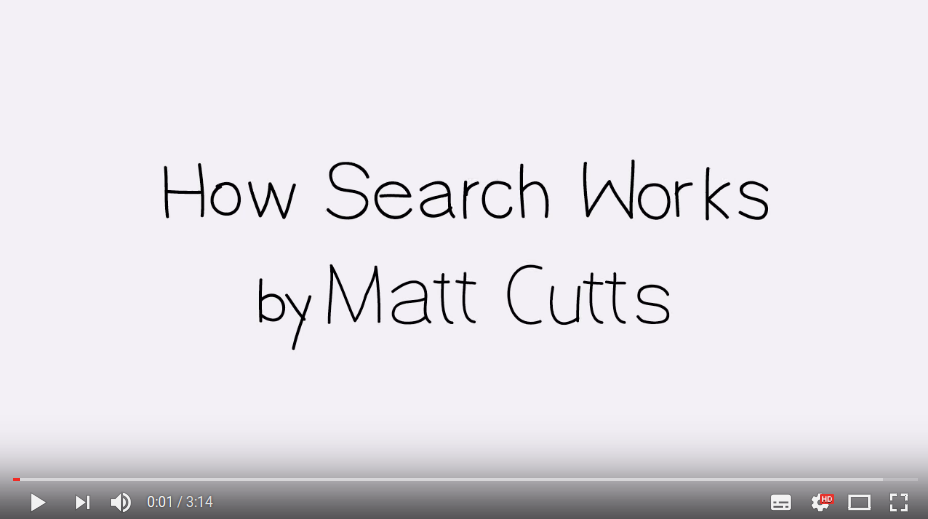

## Moteur de recherche

### Comment marche un moteur de recherche?

* **Moteur de recherche ≠ World Wide Web**
* C'est un `index` 📑 des ressources disponibles sur le `web` 🕸 collecté par le `moteur de recherche`
* Quand on fait une recherche, on va donc chercher des `ressources` stockées et rangés dans l'index du moteur de recherche qui correspondent à une `expression de recherche` et au critères de classement de ce moteur de recherche.

#### Collecter & Indexer

Comment collecter les informations du web et Pour construire l'index , collecter et ranger les données
* On utilise  un robot-araignée &#x1f577; un `spider` qui va collecter les pages web en enregistrant les mots-clés.

Pour mieux voir le principe une video de Matt Cuts (Google) qui nous explique comment marche la recherche de Google

Le principe de l collecte est bien expliqué en revanche les critères des résultats sont plus vagues

### Du coté de l'utilisateur: la recherche

Sur la page d'accueil du moteur de recherche: une barre de recherche ou l'on peut ecrire sa question. Elle est transformé en mots clés puis va chercher les correspondances dans son Index.

Cependant on ignore l'intégralité des paramêtres qui font que tel resultat arrive en premier.

### Quelles informations sont collectées?
En fonction de la manière dont elles vont servir les intérêt de ceux qui vous rendent un service.

### Les raisons pour collecter vos informations personnelles

Les critères sont fortement personnalisés aujourd'hui notamment par les données que vous lui donnez et qui lui permet de'évaluer vos préférences et votre comportement. Deux raisons pour lequels cet algorithme  de "matching" ou correspondance est tenu secret une bonne et plusieurs mauvaises raisons:
* Commerciales
* Industrielles
* Politiques

### Les enjeux du ciblage et du stockage de vos traces

* Un système juridique sur les données casi uninexistant et les lois
* Pertinence pour mieux vendre et convaincre
* Bulles de filtres
* Plus d'accès universel à l'information
* Tracking du comportement qui renforce les biais cognitifs
* Vie privée/transparence: comment se prémunir contre la surveillance généralisée?
