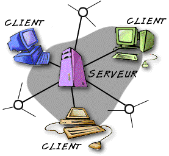
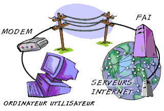
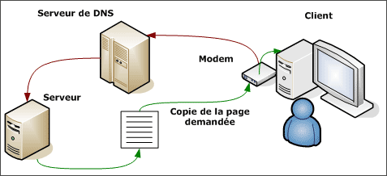

***[Culture GG] Atelier 02***
# Internet, web et réseaux

Nous utilisons Internet tous les jours, mais qui sait vraiment comment ça marche ? Ouvrons la boîte de pandore et explorons les bases de notre environnement numérique quotidien:
* Que se passe-t-il quand on se connecte à **Internet** ?
* Comment marche un **site web** ?
* Qu’est-ce qu’il y a derrière **Firefox** ou **Skype** ?
* Comment marche un **moteur de recherche** ?
* Qu’est-ce qu’une **app** ?
* Que savent de mes voyages sur la toile mon **fournisseur d’accès**, **Google** ou la **NSA** ?
* Comment conserver un semblant de **vie privée** ?

De quoi naviguer en sachant vraiment où on met les pieds, en toute tranquillité et en toute conscience !


## Sommaire

### [De mon ordinateur à la page web](#de-mon-ordinateur-à-la-page-web-1)
* [Client-Serveur : C'est comme au restaurant !](#client-serveur--cest-comme-au-restaurant-)
* [De quoi a-t-on besoin pour se connecter à l'Internet?](#de-quoi-a-t-on-besoin-pour-se-connecter-à-linternet)
* [Le navigateur et sa barre d'adresse](#le-navigateur-et-sa-barre-dadresse)
* [Protocoles de communication](#protocoles-de-communication)
    + [Le HTTP : HyperText Transfer Protocol](#le-http--hypertext-transfer-protocol)
* [L'adresse web, qu'est ce qu'on en fait ?](#ladresse-web-quest-ce-quon-en-fait)
    * [Let's play](#lets-play)
* [En cuisine : le boulot du serveur](#cest-comme-au-restaurant)
* [Le HTML, l'ingrédient préféré du World Wide Web](#le-html-lingrédient-préféré-du-world-wide-web)

### [Internet, ce n'est pas que les pages web](#internet-ce-nest-pas-que-les-pages-web-1)
* [Les protocoles d'Internet](#les-protocoles-dinternet)

### [Moteur de recherche](#moteur-de-recherche-1)
* &#128249; Comment marche un moteur de recherche?
* &#x1f577; Collecter, Indexer, classer: le robot-araignée
* &#x1f577; Les algorithmes de recherche et de ciblage
* &#127850; Données personnelles, cookies

### [Censure et vie privée](#censure-et-vie-privée-1)
* &#x1f512; Techniques de censure


## De mon ordinateur à la page web

### Client-Serveur : C'est comme au restaurant !

Quand on navigue sur le web, on évolue généralement dans ce qu'on appelle un `environnement client-serveur`. En gros, un restaurant. Ce concept présente d'un côté le `client`, celui qui va demander quelque chose (une crème au chocolat, un cocktail ou une page web) et le `serveur`, qui va faire ce qu'il faut pour lui apporter.


(*crédits : http://noamb.free.fr/presentation_web/fonctionnement/default.htm*)

Naviguer sur internet, cela revient donc à un échange entre le `client` et le `serveur`, ponctués de discussions et d'actions.

Le `client` est à l'origine de la demande, pointe son nez dans le restaurant, demande au placeur où s'asseoir puis fait une `requête` au serveur, en suivant certains protocoles. Pas question de mal parler au serveur, auquel cas il risque de crasher dans notre plat.

Le serveur va prendre notre commande si elle est à la carte, puis vas s'enquérir d'aller chercher notre plat, éventuellement en demandant à différents collègues de lui assembler les ingrédients nécessaires.

### De quoi a-t-on besoin pour se connecter à l'Internet?


(*crédits : http://noamb.free.fr/presentation_web/fonctionnement/default.htm*)

Internet, est une technologie qui nécessite plusieurs éléments pour arriver jusqu'à nous. Une partie de ces éléments sont directement à notre contact et constituent donc le minimum à posséder pour explorer ce vaste monde. Techniquement, on troque donc la tenue correcte, la carte bleue et l'estomac affamé contre les choses  suivantes :

- Un périphérique (ordinateur, téléphone, console de jeu, frigo connecté ...) qui va être notre porte d'entrée, physique (hardware) vers ce vaste monde
- Un logiciel (un client - on y reviendra) qui nous offre un service autour d'internet (le navigateur qui donne accès aux pages web, skype qui nous donne accès aux conversations instantanées, ...)
- Une liaison à un réseau de télécommunication approprié : internet arrive à la maison ou au bureau via une prise qui est reliée au réseau téléphonique, au réseau cablé, au réseau fibré voir au réseau satellite
- Un accès internet, via un fournisseur d'accès internet (FAI), qui est une entité qui gère ce réseau de télécommunication et vous en autorise l'accès tout en assurant sa gestion technique, son entretien
- Un modem et un routeur, souvent contenus dans la box du FAI, qui assurent la liaison entre chez nous et le réseau de télécommunication ; ils servent à la fois de douanier, de tour-operator, de police des frontières, d'ambassade ... ;)

### Le navigateur et sa barre d'adresse

Ça y est, on est faim prêt, on peut entrer dans le restaurant. Pour se faciliter la vie, on a regardé la carte, avant de venir et on sait ce qu'on veut : une bonne part de `http://perdu.com`, l'adresse web qui nous fait envie. On lance donc notre navigateur web et on annonce ce qu'on veut en rentrant cette adresse dans la barre ... d'adresse.

Cette adresse, elle contient deux informations :
- `perdu.com` désigne ce qu'on est venu chercher. Cela représente une ressource, disponible quelque part sur internet, un plat que le restaurant présente à la carte ;
- `http` est le protocole, c'est à dire les conventions qu'on va utiliser pour discuter avec les employés du restaurant, pour que tout se passe bien : j'enlève mon chapeau en rentrant, j'ai mit une belle cravate pour venir au McDo, je parle poliment, j'ai de quoi payer dans mes poches, je parle la même mangue que le serveur ...

### Protocoles de communication

De protocoles, dans les "télécommunications", il y en a partout ! Et l'informatique, ça fricotte pas mal avec les télécommunications. Donc on en trouve partout !
Certains sont des protocoles pour faire communiquer les appareils, et donc sont des éléments préalables au fonctionnement d'Internet, par exemple :
- le `WiFi`, protocole qui va expliquer à votre téléphone comment se relier à votre box ;
- l'`Ethernet` et, par exemple, son ami le `PPPoE`, qui vont expliquer à votre ordinateur comment discuter avec votre fournisseur d'accès via la box.
D'autres protocoles sont des protocoles liés à toutes les belles choses qu'on peut faire avec Internet :
- le SMTP, qui va expliquer à votre logiciel de messagerie comment envoyer un e-mail à votre tante ;
- le BitTorrent, qui va expliquer à votre logiciel de téléchargement comment échanger avec autrui tout ces supers films de vacances ;
- le HTTP, qui va expliquer à votre navigateur comment on va récupérer une page web pour passer une nuit entière à surfer sur wikipedia.

#### Le HTTP : HyperText Transfer Protocol

Regardons ce HTTP de plus prêt : ce protocole définit un certain nombre d'actions et explique comment faire une phrase pour décrire quelle action on veut faire.
Ces actions, ce sont par exemple :
- GET : pour aller récupérer une ressource, une page web par exemple (c'est l'action par défaut que fait le navigateur)
- POST : pour envoyer des données histoire de faire évoluer une ressource
- DELETE : pour supprimer une ressource
- ...

Finalement, quand on tape `http://perdu.com`, notre client, le navigateur, envoie une `requête` `GET` sur Internet pour récupérer la ressource `perdu.com`.

#### L'adresse web, qu'est ce qu'on en fait ?

Au restaurant, passer commande est assez facile : le serveur se pointe à la table et fait des ronds de jambe, puis écoute vos désirs.

Internet, c'est un peu plus comme un McDo : vous vous pointez avec la faim au ventre, c'est un peu le bordel, vous savez pas où aller, vous vous dirigez finalement vers une borne à qui vous faites la commande et qui vous redirige vers le bon comptoir : après un peu de latence vous aurez enfin votre porn food.

Quand le navigateur envoi sa requête (en HTTP avec l'action GET vers perdu.com), il l'envoi à un premier acteur d'internet : le serveur `DNS`. Toujours le même : celui que nous fourni notre fournisseur d'accès automatiquement, ou un qu'on a configuré dans son ordinateur ou sa box.

DNS, ça veut dire "Domain Name Service" (service de nom de domaine) et ça se charge de comprendre ce que vous avez commandé. Et oui, en vrai, pour savoir où sont les ressources, sur Internet, on utilise des adresses pas vraiment sexy à manipuler : les adresses IP. Ça ressemble à ça : `208.97.177.124`.

L'humain que nous sommes étant beaucoup plus à l'aise avec des lettres formant des mots intelligibles, on a créé le concept de "nom de domaine", le fameux `perdu.com`. On a donc le serveur `DNS` qui se charge de traduire `perdu.com` en `208.97.177.124`.

##### Let's play

Le site http://ping.eu/nslookup/ permet d'obtenir l'adresse IP liée à un nom de domaine.

Nom de domaine   | Adresse IP
---------------- | ----------------
perdu.com        | 208.97.177.124
google.com       | 172.217.22.174
fr.wikipedia.org | 91.198.174.192

#### En cuisine : le boulot du serveur

Une fois équipé de cette adresse IP, votre navigateur peut continuer son périple : envoyer sa requête au serveur `208.97.177.124`.

Le serveur va recevoir cette requête, comprendre ce qu'on lui demande, filer la commande à son cuistot. Le cuistot va identifier les ingrédients, filer des instructions à ses commis, mettre tout ça dans une assiette, avec un peu de cuisson soupoudré sur le tout et le serveur, le plat en main, va le rapporter au client.


(*crédits : http://articles.nissone.com/2008/05/html-internet/*)

La tambouille en cuisine, c'est ce qu'on appelle le "développement backend". Les trucs qu'on voit pas. On peut faire ça en Python, en PHP, en Java, bref, en un peu prêt n'importe quel langage de programmation. On peut même en utiliser plusieurs à la fois : le cuisto et les commis ont leur propres techniques, leur propre savoir faire.
En plus du petit personnel, on va trouver plein d'autres choses indispensables : bases de données (les réfrigérateurs), autres serveurs qui vont fournir des ressources essentielles à la composition de la ressource demandée (un peu comme un restaurant, qui est lui même client de ses fournisseurs d'ingrédients bruts).

Dans les assiettes qui sortent des cuisines, on trouve de tout : entrées, plats, desserts, cocktails, cachouètes ... C'est à dire qu'une requête auprès d'un serveur peut demander la récupératio d'une page web, mais aussi, plus simplement, d'une image, d'une musique, d'une vidéo ...

Si tout le monde sait à peu près ce que sont ces derniers types de fichiers, la page web est quelque chose de plus mystérieux, composé en grande partie d'un ingrédient magique : le HTML.

#### Le HTML, l'ingrédient préféré du World Wide Web

Le HTML, c'est un langage de description de contenu. Presque comme un langage de programmation, mais fait pour décrire un contenu plutôt qu'écrire un algorithme.

Sur la page `http://perdu.com`, faites un clic-droit et 'Inspecter l'élément' ou 'Éxaminer l'élément' (ou faites Ctrl-Shift-I avec votre clavier). Un panneau spécial du navigateur s'ouvre, qui permet d'aller plonger au coeur de la page web, de quoi elle est constituée.

Ce qu'on voit alors apparaitre, c'est le HTML qui compose cette page :

```HTML
<html>
  <head>
    <title>
      Vous Etes Perdu ?
    </title>
  </head>
  <body>
    <h1>
      Perdu sur l'Internet ?
    </h1>
    <h2>
      Pas de panique, on va vous aider
    </h2>
    <strong>
      <pre>    * &lt;----- vous êtes ici</pre>
    </strong>
  </body>
</html>
```

Nous entrerons plus en détail sur comment fonctionne le HTML, dans un atelier ultérieur, sur le webmining, mais on peut déjà identifier les choses suivantes : le HTML déclare des mots clés, des "éléments", qui permettent de baliser le contenu et qu'on reconnait aux chevrons qui les encadrent : `<html>` ou `<h2>` par exemple.

`html` balise les limites de la page web, `body` représente les frontière du contenu visible de la page, tandis que `head` encadre des éléments d'en-tête, c'est à dire des métadonnées, des informations complémentaires au contenu. `h1` et `h2` vont entourer des titres de premier et de second niveau (des grands titres et des titres un peu moins grands ;))

Les grands copains du HTML, ce sont :
- le CSS (`Cascading Style Sheet` ou `Feuilles de Style en Cascade`), un langage de style, qui s'occupe de rendre joli le contenu défini en HTML. Un bon moyen d'explorer ça est le site http://www.csszengarden.com/ qui propose un même HTML décliné selon différentes feuilles de style ;
- le JS (`JavaScript`), un langage de programmation qui fourni tout ce qu'il faut pour manipuler et transformer le HTML, et donc qui permet de rendre dynamique les pages web : faire bouger des éléments, en changer le contenu, offrir de l'interactivité, etc.

## Internet, ce n'est pas que les pages web

### Les protocoles d'Internet

Une page web, c'est une ressource du World Wide Web, une partie d'Internet où le HTTP (et sa version **S**écurisée, le HTTP**S**) est roi et où le contenu multimédia est présenté au milieu de pages écrites en HTML, CSS et JS.

Mais Internet est bien plus vaste que ça. En effet, un serveur est aussi capable de parler en suivant d'autres protocoles, et donc par exemple de fournir autre chose que des pages web :
- FTP permet de déposer des fichiers sur un serveur comme si c'était un disque de notre ordinateurs
- IMAP, POP3 ou SMTP permettent d'échanger des courriers électroniques, de gérer des boites e-mail
- IRC ou XMPP permettent de créer des salons de discussions, de faire des profils personnels, etc (Google Hangout ou Facebook Messenger sont basés sur XMPP)
- SIP ou VoIP permettent de faire de la "voix su IP", c'est à dire de la téléphonie ou de la visio-conférence
- SSH permet de travailler sur un serveur distant comme si on était sur son propre ordinateur
- WebDAV permet de gérer des évènements et des calendriers
- LDAP permet de gérer un annuaire et des listes de comptes, pour gérer des droits d'accès par exemple
- etc.
